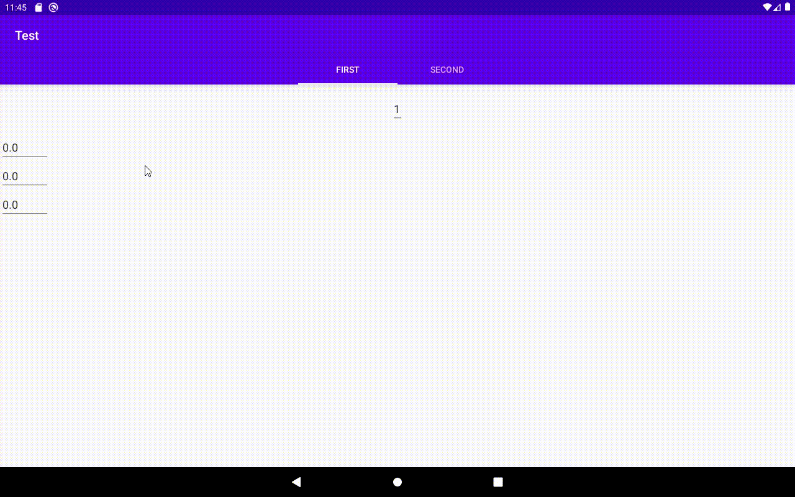

# ViewPager2 bug report
This repository is a demonstration of the bug with ViewPager2.
## Explanation:
The main screen of application contains a viewpager with two tabs. Each tab has a recycler view with items, contain EditText element.
When user touches EditText inside item, the focus accidentially loses.
Also there is a simple EditText on every tab (not in recycler, just on a tab fragment). It works pretty well and doesn't drop a focus.

